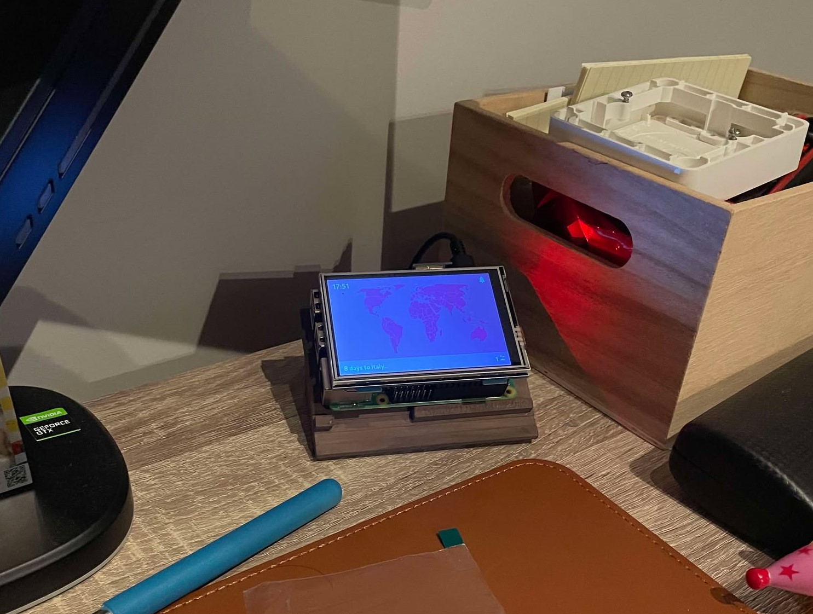

# Flight Assistant&#x20;


Flightassistant was designed to keep track of the countries that one has visited through out our lives. FlightAssistant is a companion application that can be displayed on your nightstand or desk, and can be used by any device that can host a website. With an compact interface displayed on a small screen, it offers features to help you explore the world, track your travels, and plan your next adventure.

Here is an example of a raspberry pi model 4 displaying it on a small screen on a desk:




## Features

### Landing page

The features are accessible through a landing page that provides  interaction with all functionalities.

### 1. Interactive World Map

- **Colored countries**: Visualize the countries you've visited on a world map.
- **Personal milestones**: See how many countries you’ve visited.

### 2. Trip Countdown

- **Days to next trip**: Watch the countdown on when your next trip arrives.

### 3. Flight Deal Notifications

- **Country preferences**: Pick specific countries you are interested in visiting, and the application will monitor flight prices for you.
- **Real-time notifications**: Receive alerts when the server finds great deals for your selected destinations.
- **Bell on top right corner**: Starts blinking red when a good price has been found

## Tech Stack

### Backend

- **SQL Database**: Manages data related to visited countries, upcoming trips, and user preferences.
- **.NET Web API**: Powers the application with secure and efficient endpoints for managing and fetching data.

### Frontend

- **React**:

### Device Integration

- A small display unit for your nightstand, powered by a Raspberry pi model 4.


**API for Flight prices monitoring**

Make a free account on Serpapi.com and paste your API key. This gives you a 100 free quries a month.

## Installation

### Prerequisites

- .NET runtime installed on your server.
- Node.js and npm for running the React frontend.
- SQL database server configured and running.

### Backend Setup

1. Clone the repository:
   ```bash
   git clone https://github.com/your-repo/flightassistant.git
   cd flightassistant/backend
   ```
2. Restore dependencies:
   ```bash
   dotnet restore
   ```
3. Update the `appsettings.json` file 
 ```bash
   {
    "Logging": {
        "LogLevel": {
        "Default": "Information",
        "Microsoft.AspNetCore": "Warning"
        }
    },
    "ConnectionStrings": {
        "DefaultConnection": "Host=localhost;Port=5432;Database=FlightAssistant;Username=worker1;Password=2orker1"
    },
    "QuerySettings": {
        "QueryAtHour": 12,
        "QueryPerNDay": 5,
        "MaxQueries": 14,
        "DeleteNOld": 15,
        "ApiKey": "YOURAPIKEY"
    },
    "AllowedHosts": "*"
    }
   ```

Make sure the user has priveligies to your postgres db.

1. Run the backend server:
   ```bash
   dotnet run
   ```

### Frontend Setup

1. Navigate to the frontend directory:
   ```bash
   cd ../frontend
   ```
2. Install dependencies:
   ```bash
   npm install
   ```
3. Create .env file
   ```bash
   REACT_APP_SERVER_API_URL=http://localhost:5208/api
   REACT_APP_SERVER_MAP_URL=http://localhost:5208/mapHub
   ```

4. Start the development server:
   ```bash
   npm start
   ```

### Device Integration

- Run on any device that can host a website

---

